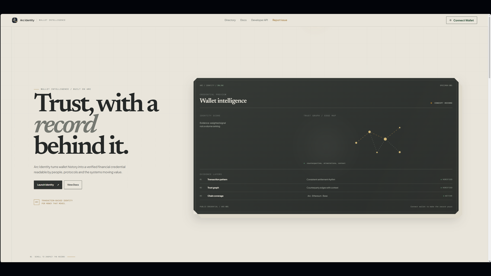
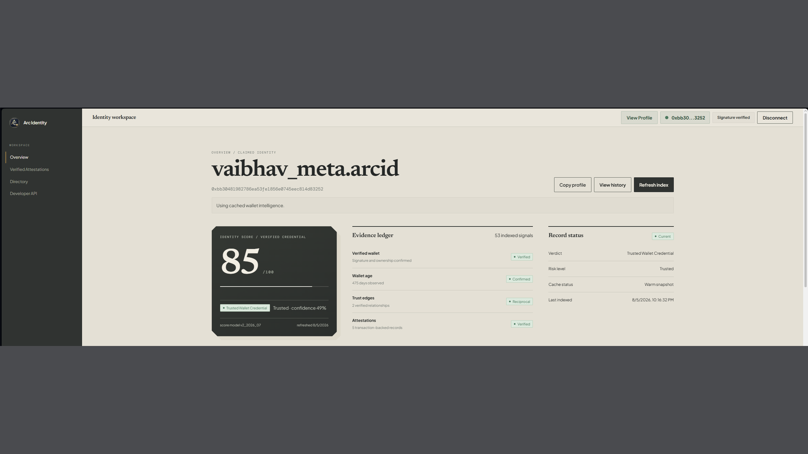
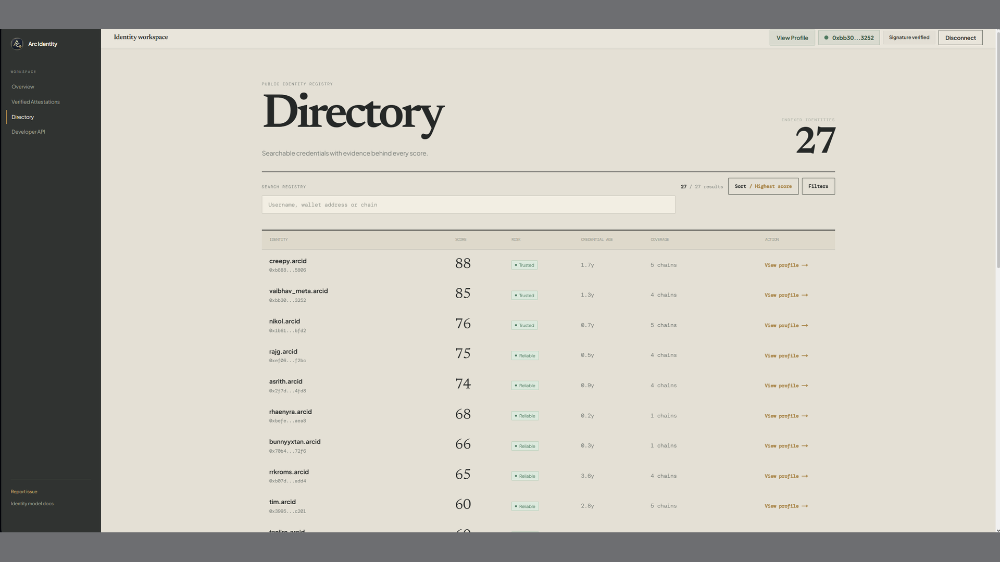
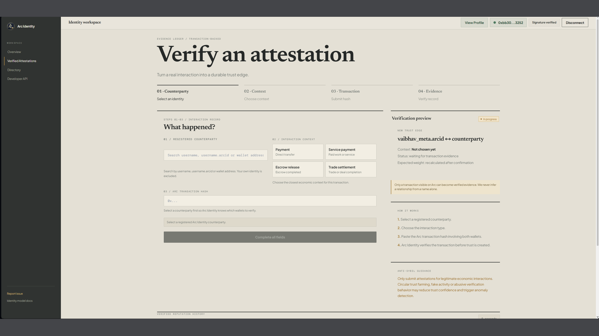
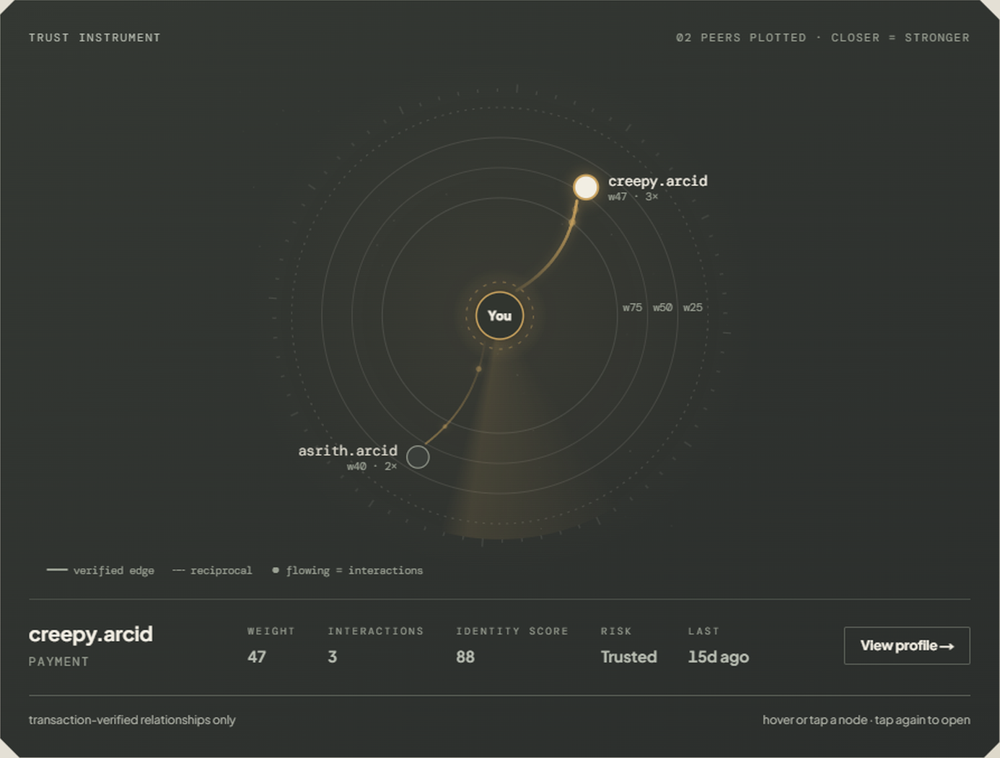
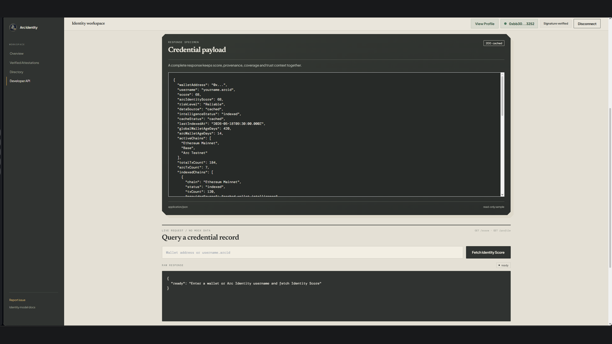
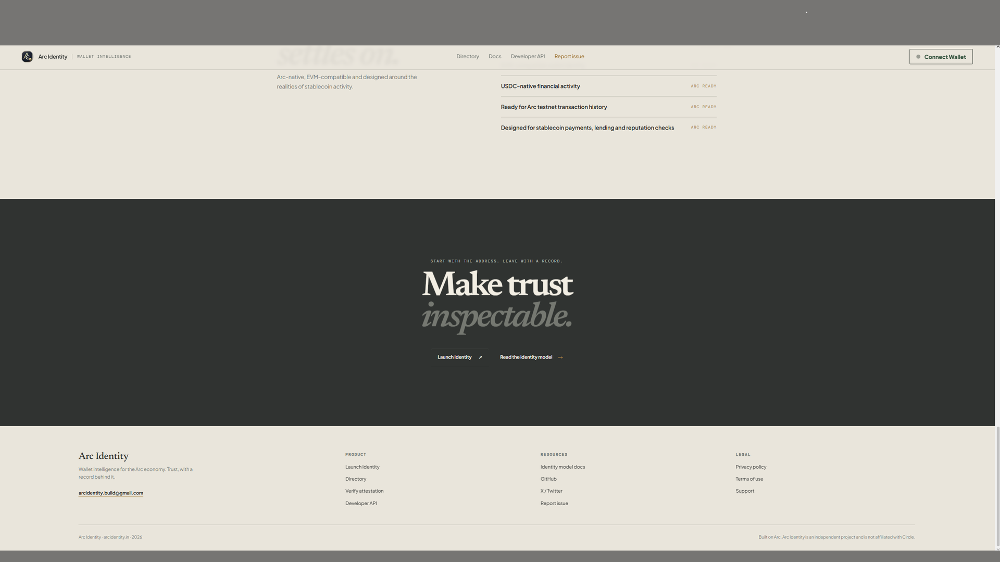

<div align="center">

# Arc Identity

**Wallet intelligence for the Arc economy. Trust, with a record behind it.**

Arc Identity turns public wallet history into a verified financial credential readable by people, protocols and the systems moving value.

[**arcidentity.in**](https://arcidentity.in) - [Identity model docs](https://arcidentity.in/docs) - [Developer API](https://arcidentity.in/developers)

[Privacy](./PRIVACY.md) - [Terms](./TERMS.md) - [Security](./SECURITY.md)


</div>

---

## Repository docs

| Document | Purpose |
| --- | --- |
| [Privacy](./PRIVACY.md) | Public copy of the privacy policy |
| [Terms](./TERMS.md) | Public copy of the terms of use |
| [Security](./SECURITY.md) | Vulnerability reporting and user safety rules |
| [Contributing](./CONTRIBUTING.md) | Local setup, review rules and contribution guidelines |

## What it does

Most reputation tools rank wallets by volume. Arc Identity ranks them by evidence.

The engine indexes public activity across supported networks, verifies transaction-backed attestations between wallets, maps counterparty relationships into a trust graph and compresses all of it into a deterministic Identity Score with every input disclosed. The result is a public credential page any person or protocol can inspect.

- **Evidence over volume.** Every point on a score traces back to indexed transactions, verified attestations or trust relationships.
- **Deterministic scoring.** The same committed evidence always produces the same score under the same model version.
- **Explainable by design.** Profiles expose the component breakdown, caps, penalties and data provenance behind the score.
- **Built for the Arc economy.** Native to Arc testnet activity and designed around stablecoin settlement patterns, with multichain context from Ethereum, Base, Arbitrum, Polygon and BNB Chain.

## Product tour

<table>
  <tr>
    <td width="50%" valign="top">
      <h3>Landing page</h3>
      <p>The public face of the credential. Start with the address. Leave with a record.</p>
      
    </td>
    <td width="50%" valign="top">
      <h3>Identity workspace</h3>
      <p>The signed-in overview with score, evidence ledger and signature-verified wallet ownership.</p>
      
    </td>
  </tr>
  <tr>
    <td width="50%" valign="top">
      <h3>Directory</h3>
      <p>A searchable public registry of claimed identities with score, risk, age and chain coverage.</p>
      
    </td>
    <td width="50%" valign="top">
      <h3>Verified attestations</h3>
      <p>Transaction-backed claims that are checked onchain before they affect trust.</p>
      
    </td>
  </tr>
  <tr>
    <td width="50%" valign="top">
      <h3>Trust graph</h3>
      <p>Counterparties plotted around a wallet, where closer edges mean stronger verified relationships.</p>
      
    </td>
    <td width="50%" valign="top">
      <h3>Developer API</h3>
      <p>Credential JSON with score, provenance, coverage and trust context in one response.</p>
      
    </td>
  </tr>
  <tr>
    <td colspan="2" valign="top">
      <h3>Closing section</h3>
      <p>The final product statement and public links.</p>
      
    </td>
  </tr>
</table>


## Identity Score model

The production model is versioned as `arc_score_v2_2026_07`. It is deterministic and evidence capped. A wallet with no indexed or verified evidence starts at 0. Profile creation alone is worth nothing.

| Evidence category | Max points |
| --- | --- |
| Arc activity | 25 |
| Global wallet age | 20 |
| Indexed transaction activity | 15 |
| Counterparty diversity | 15 |
| Verified transaction attestations | 15 |
| Active chain coverage | 5 |
| Propagated trust | 5 |

Anomaly evidence and excessive repeated-pair concentration can apply a disclosed penalty of up to 10 points.

Transaction count is one bounded input, not the whole result. Two wallets with similar raw activity can rank differently when Arc footprint, counterparties, verified attestations or risk signals differ. The public profile and score API expose the exact component points behind every comparison.

## Architecture

```txt
app/            Pages and API routes (Next.js App Router)
  api/          REST endpoints for score, profile, trust, attestations and onchain data
  profile/      Public credential pages
  dashboard/    Signed-in identity workspace
  docs/         Identity model documentation
components/     UI components including the trust graph and evidence panels
lib/            Core engine
  score.ts            Scoring pipeline
  score-contract.ts   Versioned model contract and component caps
  trust-graph.ts      Trust propagation and edge weighting
  multichain.ts       Cross-chain indexing
  onchain.ts          Live RPC readers
  signature.ts        Wallet ownership verification
data/           Static reference data
scripts/        Score contract tests, audits and maintenance jobs
```

Production deployment configuration, private environment files and database operations are intentionally excluded from this public mirror.

## API

Base URL: `https://arcidentity.in`

| Endpoint | Returns |
| --- | --- |
| `GET /api/score/:wallet` | Identity Score with component breakdown, risk level and chain intelligence |
| `GET /api/profile/:username` | Full public credential including trust graph and attestation history |
| `GET /api/onchain/:wallet` | Indexed transaction analytics and counterparty metrics |

Example:

```bash
curl https://arcidentity.in/api/score/0xYourWalletAddress
```

Responses include the model version, cache status and last indexed timestamp so consumers can reason about freshness.

## Tech stack

| Layer | Technology |
| --- | --- |
| Framework | Next.js 15 App Router with React and TypeScript |
| Styling | Tailwind CSS with a custom editorial design system |
| Wallet layer | viem for RPC reads and signature verification |

## Getting started

Requires Node.js 20 or later.

```bash
git clone https://github.com/vaibhav0xq/arc-identity-public.git
cd arc-identity-public
npm install
```

Create `.env.local` in the project root:

```env
NEXT_PUBLIC_APP_URL=
NEXT_PUBLIC_ARC_RPC_URL=
NEXT_PUBLIC_ARC_CHAIN_ID=
NEXT_PUBLIC_ARC_EXPLORER_URL=
NEXT_PUBLIC_WALLETCONNECT_PROJECT_ID=
ETHERSCAN_API_KEY=
BASESCAN_API_KEY=
ARBISCAN_API_KEY=
POLYGONSCAN_API_KEY=
BSCSCAN_API_KEY=
```

Run the development server:

```bash
npm run dev
```

The app is available at `http://localhost:3000`.

## Scripts

| Command | Purpose |
| --- | --- |
| `npm run dev` | Start the development server |
| `npm run build` | Production build |
| `npm run typecheck` | TypeScript checks without emitting |
| `npm run test:score-contract` | Verify the score model against its contract |
| `npm run test:score-api` | Integrity checks against the score API |

## Roadmap

**Now**

- Deterministic reputation engine with disclosed caps and penalties
- Public credential pages, directory and trust graph
- Transaction-backed attestations with onchain verification
- Developer API

**Next**

- Deeper trust propagation and reciprocal relationship weighting
- Expanded chain coverage
- Wallet clustering and stronger sybil resistance

**Later**

- Credit intelligence primitives
- Protocol integrations, SDKs and developer tooling

## Security

No legitimate Arc Identity surface will ever ask for private keys or seed phrases. Wallet ownership is proven by signature only.

Found a vulnerability? See [SECURITY.md](./SECURITY.md) for how to report it responsibly. Repository copies of the public policy pages are available in [PRIVACY.md](./PRIVACY.md) and [TERMS.md](./TERMS.md).

## Contributing

Issues and pull requests are welcome. Read [CONTRIBUTING.md](./CONTRIBUTING.md) for setup, conventions and the review process before opening one.

## Disclaimer

Arc Identity is informational. It is not financial advice, not a credit bureau and it never takes custody of funds. It is an independent project built on the Arc network and is not affiliated with Circle or any network operator.

## Author

Built by **Vaibhav** ([@vaibhav0xq](https://github.com/vaibhav0xq)) - [X](https://x.com/arcidentityhq) - [arcidentity.build@gmail.com](mailto:arcidentity.build@gmail.com)

Web3 builder focused on wallet intelligence, trust systems and blockchain identity infrastructure.
