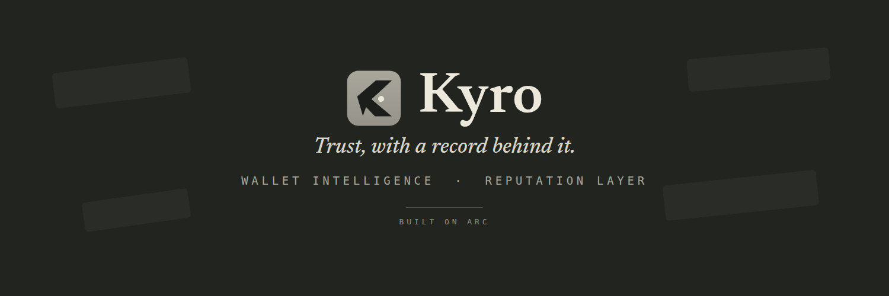
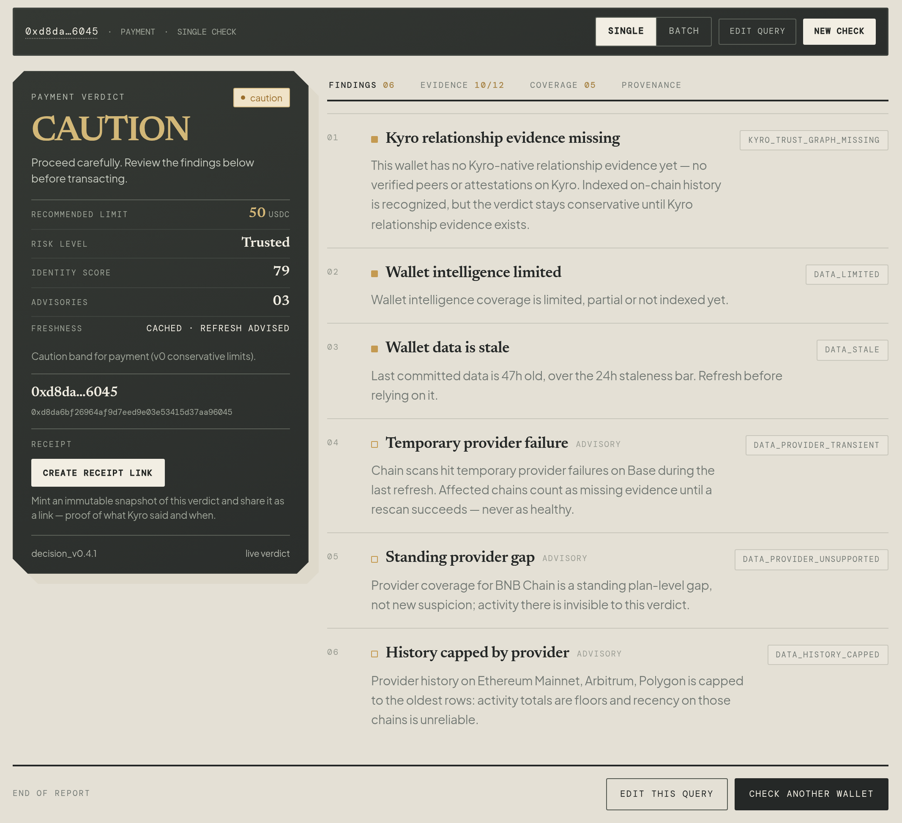
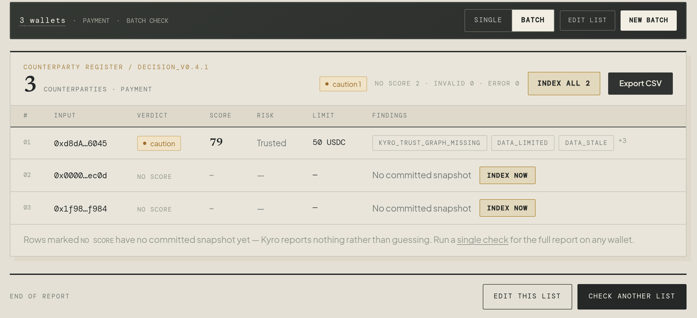
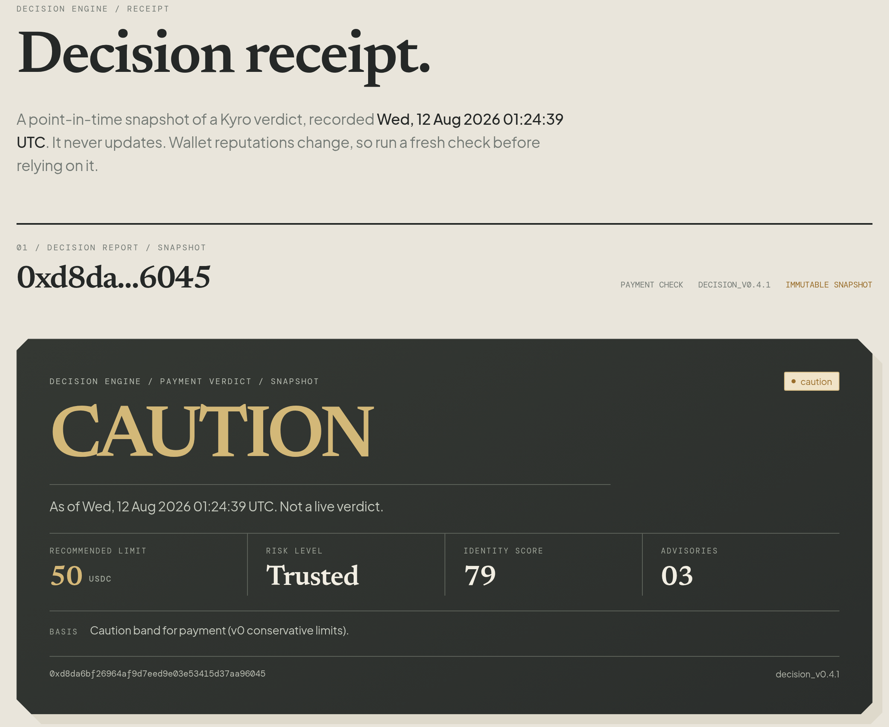
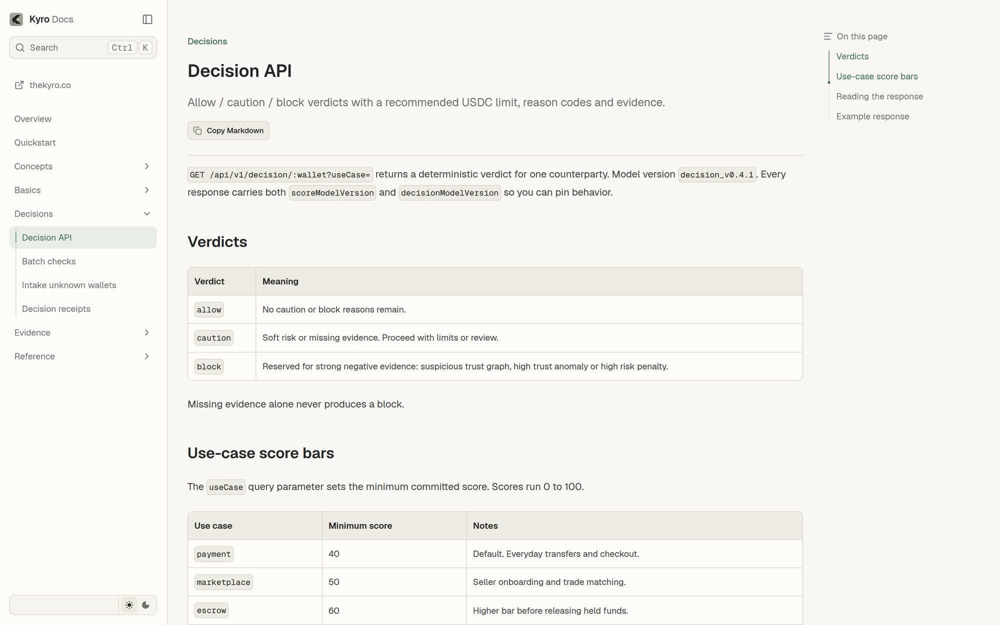

<div align="center">



<br />

**Know your counterparty before funds move.**

Kyro is a wallet intelligence and reputation platform for pre-transaction decisions.
Ask one question: should you transact with this wallet right now. Allow, caution or block, built from evidence and honest about coverage.

[Website](https://www.thekyro.co) · [Live check](https://www.thekyro.co/check) · [Docs](https://docs.thekyro.co) · [API spec](./public/kyro-openapi.yaml) · [SDK](./sdk/typescript) · [Examples](./examples) · [Release](https://github.com/vaibhav0xq/kyro-public/releases/latest) · [X](https://x.com/KyroIdentity)

[](./LICENSE)
[](./public/kyro-openapi.yaml)
[](./sdk/typescript)
[](https://docs.thekyro.co)
[](https://github.com/vaibhav0xq/kyro-public/releases/latest)

</div>

---



<p align="center"><sub>A completed check on the live console: verdict, recommended limit and reason codes, with the evidence and coverage tabs the verdict was built from. The wallet shown is a public example wallet.</sub></p>

Before you pay, escrow, lend to or onboard a wallet, Kyro answers one question: should you transact with this counterparty right now. The check is the front door. Underneath it is a wallet intelligence layer: indexed on-chain history across supported chains, a trust graph built from attestations between wallets and reputation evidence carried by every Kyro identity. Every check returns an allow, caution or block verdict with machine readable reason codes, a recommended USDC limit and the evidence rows the verdict was built on. Verdicts are deterministic and conservative by design: missing evidence never counts in a wallet's favor; it shows up as reduced coverage instead.

## What Kyro does

- **Wallet intelligence.** Kyro indexes a wallet's on-chain history across supported chains into evidence: activity, counterparties and longevity, every row tied to where it came from.
- **Reputation evidence.** Wallets claim a Kyro username, build a trust graph through attestations and carry a scored reputation across chains. Scores summarize evidence; they never replace it.
- **Counterparty check workbench** at [thekyro.co/check](https://www.thekyro.co/check). Paste a wallet or username, pick a use case and read the verdict with the evidence and coverage behind it. No account needed.
- **Decision API.** Anonymous access on every endpoint; API keys raise the rate budget. One `GET` call returns the verdict, reasons, limit, evidence and freshness.
- **Decision receipts.** Immutable, shareable snapshots of a verdict: proof of what Kyro said and when.
- **Batch screening** for payroll runs, grant payouts, escrow batches and allowlists.

## How a verdict is made

Three things produce every verdict, all of them visible in the product:

- **Evidence.** Indexed activity, trust graph attestations and identity signals: the rows a verdict cites, each with its source.
- **Coverage.** An explicit account of what was and was not indexed for this wallet and how fresh it is. Verdicts state their coverage instead of hiding gaps.
- **Missing data handling.** Thin evidence produces a conservative verdict and a reason code that says why, never a confident guess.

## Product surfaces

### Batch screening



<sub>One run across many wallets, each row with its own verdict and limit. Rows without a committed snapshot say so instead of guessing.</sub>

### Decision receipts



<sub>A decision receipt: an immutable snapshot of a verdict with its evidence, made to be shared. It never updates.</sub>

### Developer docs and API contract



<sub>The developer docs at [docs.thekyro.co](https://docs.thekyro.co): evidence and coverage concepts, rate budgets and an API reference built from the OpenAPI contract.</sub>

## Repository map

| Path | Contents |
| --- | --- |
| `app/`, `components/`, `lib/`, `hooks/` | The Next.js app surface: landing, check workbench, receipt pages, dashboard and developer pages |
| `public/kyro-openapi.yaml` | The frozen v1 API contract, also as a PDF in `public/docs/` |
| `sdk/typescript/` | TypeScript SDK generated from the spec |
| `docs-site/` | Source of [docs.thekyro.co](https://docs.thekyro.co) |
| `examples/` | Runnable scripts that call the public API |
| `scripts/` | Offline test suites for the published client logic |

The engine behind the API (the scoring pipeline, decision rules, data providers and persistence) runs in the hosted service and is not part of this repository. Everything here builds and runs against the hosted public API.

## Run the app locally

Node.js 20 or later.

```bash
npm install
npm run dev
```

Open `http://localhost:3000`. API calls are proxied to the hosted service, so the check workbench and receipt pages work out of the box. Set `KYRO_API_ORIGIN` to point the surface at a different deployment. Wallet bound flows such as claiming a username talk to the live service and follow the same rules as the website. Pages for public profiles and the wallet directory render only on the hosted deployment.

## Call the API

No key needed to start:

```bash
curl "https://www.thekyro.co/api/v1/decision/0x1234567890abcdef1234567890abcdef12345678?useCase=payment"
```

Rate budgets, API keys, reason codes and every endpoint are documented at [docs.thekyro.co](https://docs.thekyro.co). The complete contract lives in [`public/kyro-openapi.yaml`](./public/kyro-openapi.yaml) and more runnable calls live in [`examples/`](./examples).

## TypeScript SDK

```ts
import { Kyro } from "@kyrodev/sdk";

const kyro = new Kyro({ apiKey: process.env.KYRO_API_KEY });
const decision = await kyro.decisions.check("0x1234...5678", { useCase: "escrow" });
```

The SDK wraps all ten v1 operations with typed methods, a shared error model and rate limit metadata. It is on npm as [`@kyrodev/sdk`](https://www.npmjs.com/package/@kyrodev/sdk): `npm install @kyrodev/sdk`. To build from source instead, see [`sdk/typescript/README.md`](./sdk/typescript/README.md).

## Development checks

```bash
npm run typecheck
npm run test:intake-pacing
```

The SDK and the docs site are separate packages with their own commands, documented in their READMEs.

## Policies

[Privacy](./PRIVACY.md) · [Terms](./TERMS.md) · [Security policy](./SECURITY.md) · [Contributing](./CONTRIBUTING.md)

## License

Code and documentation in this repository are released under the [MIT License](./LICENSE). The Kyro name, the Kyro logo and the brand assets under `public/brand/` are not covered by the MIT grant and remain all rights reserved. Use of the hosted service and its API is governed by the [Terms](./TERMS.md).
