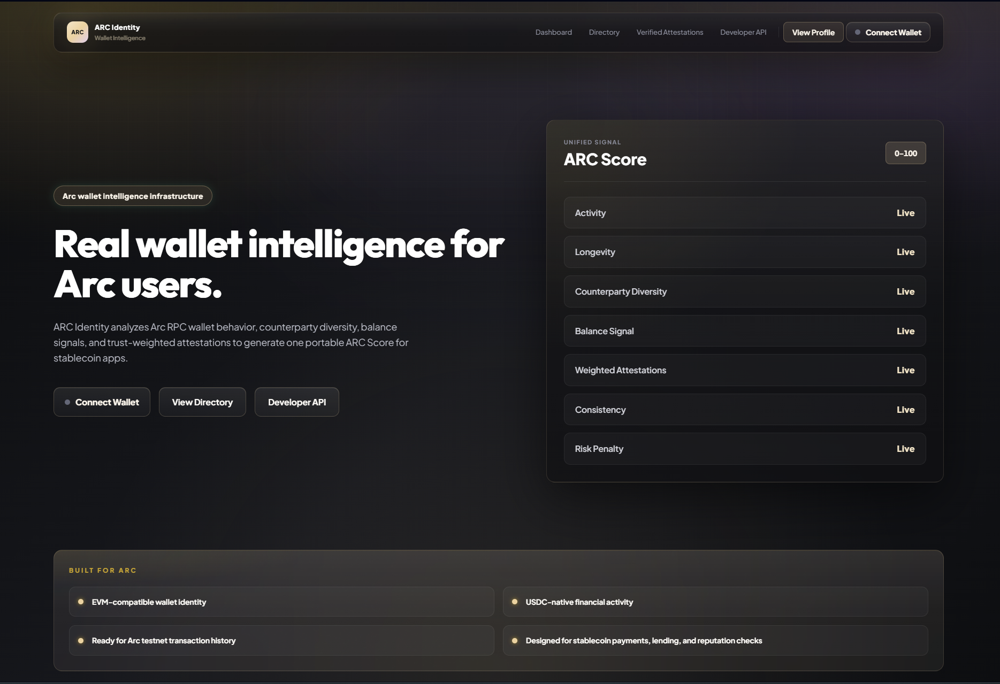
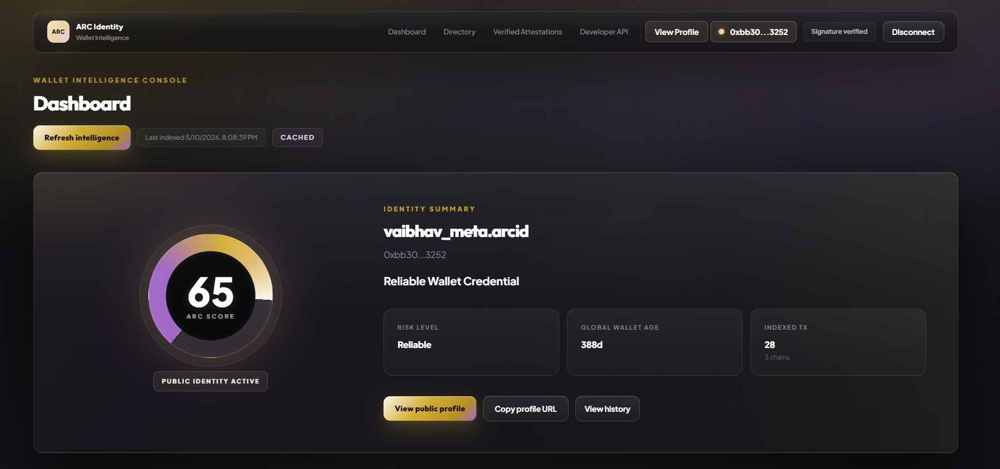
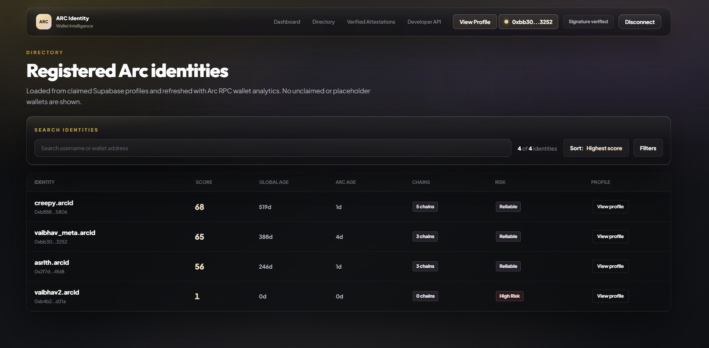
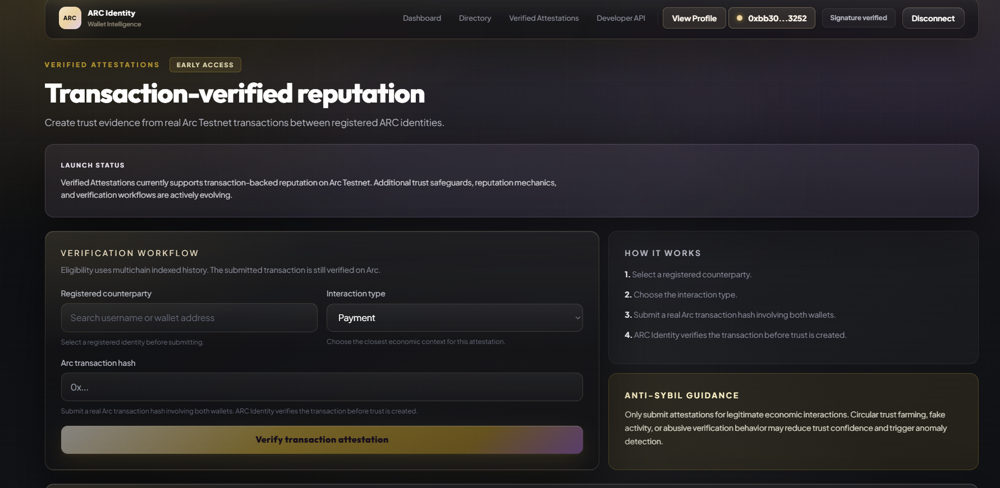

# ARC Identity

Wallet intelligence and reputation infrastructure for the ARC ecosystem.

ARC Identity transforms raw wallet activity into readable identity intelligence using:
- live onchain analytics
- transaction-backed attestations
- trust graph relationships
- multichain activity indexing
- reputation scoring
- wallet credibility insights

---

# Screenshots

## Homepage



---

## Dashboard



---

## Directory



---

## Verified Attestations



---

# Overview

ARC Identity is designed to provide a reputation and intelligence layer for blockchain wallets.

Instead of treating wallets as anonymous addresses, ARC Identity analyzes:
- transaction history
- counterparties
- wallet age
- trust relationships
- attestation activity
- chain participation
- behavioral consistency

to generate a transparent and explainable identity score.

The system supports:
- live ARC RPC intelligence
- multichain indexing
- trust propagation
- attestation verification
- profile discovery
- developer APIs

---

# Core Features

## Wallet Reputation Scoring

Dynamic reputation scoring system based on:
- wallet age
- transaction depth
- cross-chain activity
- trust relationships
- verified attestations
- activity consistency

---

## Live ARC RPC Intelligence

Real-time wallet intelligence directly from ARC RPC:
- live balances
- latest block tracking
- transaction counts
- recent activity
- freshness verification

Supports:
- live RPC
- cached snapshots
- fallback verification layers

---

## Transaction-Backed Attestations

Users can verify interactions between wallets through:
- transaction-linked attestations
- trust confirmations
- interaction history
- counterpart validation

---

## Trust Graph System

Wallet relationships are transformed into a trust network.

Includes:
- trust propagation
- interaction weighting
- counterpart diversity
- credibility signals

---

## Multichain Coverage

Chain intelligence across multiple networks:
- ARC Testnet
- Ethereum
- Polygon
- Base
- Arbitrum
- BNB Chain

Chain explorer includes:
- indexed chains
- limited providers
- no-activity chains
- provider source tracking

---

## Public Wallet Profiles

Custom wallet identity profiles:
- public identity pages
- reputation visualization
- chain activity summaries
- explainable score reasoning

Example:
```txt
/profile/[username]
```

---

## Developer API

REST APIs for:
- wallet intelligence
- reputation scoring
- trust analysis
- onchain activity
- profile retrieval

---

# Technology Stack

## Frontend
- Next.js 14
- React
- TypeScript
- TailwindCSS

## Backend
- Next.js API Routes
- Supabase
- ARC RPC
- Multichain provider integrations

## Infrastructure
- Vercel
- GitHub
- Supabase PostgreSQL

---

# Project Structure

```txt
app/
components/
lib/
data/
supabase/
```

## Important Directories

### app/
Frontend pages and API routes.

### components/
Reusable UI components.

### lib/
Core intelligence engine:
- scoring
- trust graph
- multichain indexing
- live RPC readers
- wallet intelligence

### supabase/
Database schema and migrations.

---

# Intelligence Architecture

## Reputation Engine

The scoring engine evaluates:
- wallet maturity
- interaction quality
- network diversity
- activity depth
- attestation trust

Scores are explainable through:
- score explainability cards
- factor breakdowns
- risk penalties
- trust metrics

---

## Live RPC Layer

ARC Identity prioritizes:
1. live RPC data
2. cached indexed snapshots
3. verified attestation fallback

This ensures:
- fast responses
- accurate balances
- resilient infrastructure

---

## Chain Intelligence

Each supported chain is categorized as:
- indexed
- limited provider
- no activity

Chain explorer provides:
- tx counts
- wallet age
- counterparties
- activity history
- provider source visibility

---

# Current Features

- Wallet reputation scoring
- Public identity profiles
- Live ARC RPC balance tracking
- Chain explorer modal
- Score explainability
- Trust graph system
- Transaction-backed attestations
- Developer API
- Wallet intelligence refresh system
- Multichain analysis
- Responsive UI
- Live freshness indicators

---

# API Examples

## Wallet Score

```http
GET /api/score/:wallet
```

Returns:
- reputation score
- trust metrics
- live ARC balance
- chain intelligence
- activity analytics

---

## Public Profile

```http
GET /api/profile/:username
```

Returns:
- wallet identity profile
- score breakdown
- chain coverage
- trust insights

---

## Onchain Activity

```http
GET /api/onchain/:wallet
```

Returns:
- transaction analytics
- activity history
- counterpart metrics
- wallet statistics

---

# Local Development

## Clone Repository

```bash
git clone https://github.com/your-username/arc-identity.git
cd arc-identity
```

---

## Install Dependencies

```bash
npm install
```

---

## Configure Environment Variables

Create:
```txt
.env.local
```

Example:
```env
NEXT_PUBLIC_APP_URL=https://arcidentity.in
NEXT_PUBLIC_ARC_RPC_URL=
NEXT_PUBLIC_ARC_CHAIN_ID=
NEXT_PUBLIC_ARC_EXPLORER_URL=
NEXT_PUBLIC_SUPABASE_URL=
NEXT_PUBLIC_SUPABASE_ANON_KEY=
SUPABASE_SERVICE_ROLE_KEY=
NEXT_PUBLIC_WALLETCONNECT_PROJECT_ID=
ETHERSCAN_API_KEY=
BASESCAN_API_KEY=
ARBISCAN_API_KEY=
POLYGONSCAN_API_KEY=
BSCSCAN_API_KEY=
```

---

## Run Development Server

```bash
npm run dev
```

Application/Local server:
```txt
http://localhost:3000
```

---

# Build Verification

```bash
npm run typecheck
npm run build
```

---

# Roadmap

## Phase 1
- Reputation engine
- Wallet profiles
- Trust graph
- Multichain support

## Phase 2
- Advanced trust propagation
- Wallet clustering
- AI-assisted reputation analysis
- Expanded chain coverage

## Phase 3
- Credit intelligence
- Sybil resistance systems
- Protocol integrations
- SDKs and developer tooling

---

# Security Notes

Sensitive files are excluded using `.gitignore`.

Never commit:
- `.env.local`
- API secrets
- RPC credentials
- private keys

---

# Status

Current state:
- Active development
- Private infrastructure
- Internal testing phase
- Production deployment preparation

---

# License

Private repository.
All rights reserved.

---

# Author

Built by:

**Vaibhav (@vaibhav0xq)**

Web3 builder, researcher, moderator, and infrastructure contributor focused on wallet intelligence, trust systems, and blockchain identity infrastructure.
